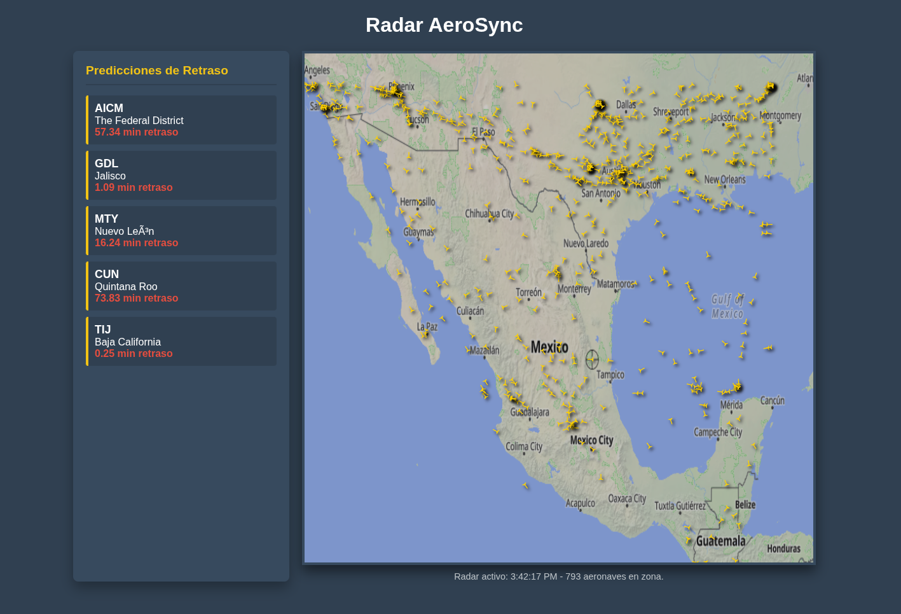

# Flight Monitoring & Delay Prediction System



Proyecto distribuido para monitoreo de vuelos en tiempo real y predicción de retrasos utilizando procesamiento paralelo, programación asíncrona y visualización web.

## Características

- Obtención de vuelos sobre México mediante APIs.
- Procesamiento distribuido con MPI.
- Conversión de coordenadas geográficas.
- Consultas concurrentes a APIs de clima.
- Predicción de retrasos de vuelos.
- Dashboard HTML en tiempo real.
- Ejecución periódica mediante scheduler asíncrono.

## Arquitectura

| Componente | Descripción |
|---|---|
| Scheduler | Ejecuta el pipeline periódicamente |
| Rank 0 | Obtiene y distribuye datos |
| Ranks Workers | Procesan vuelos en paralelo |
| Modelo Predictivo | Predice retrasos usando clima |
| Dashboard | Visualiza información en tiempo real |

## Flujo del Sistema

1. Rank 0 obtiene datos de vuelos.
2. Los datos se distribuyen entre ranks usando MPI.
3. Cada rank procesa coordenadas.
4. Rank 0 junta resultados y escribe archivos.
5. Los ranks consultan clima por aeropuerto.
6. El modelo genera predicciones de retraso.
7. El dashboard actualiza información continuamente.

## Tecnologías

- Python
- asyncio
- mpi4py
- NumPy
- HTML/CSS/JavaScript
- APIs REST

## Ejecución

Ejemplo de ejecución con MPI:

```bash
chmod+x init
./init
